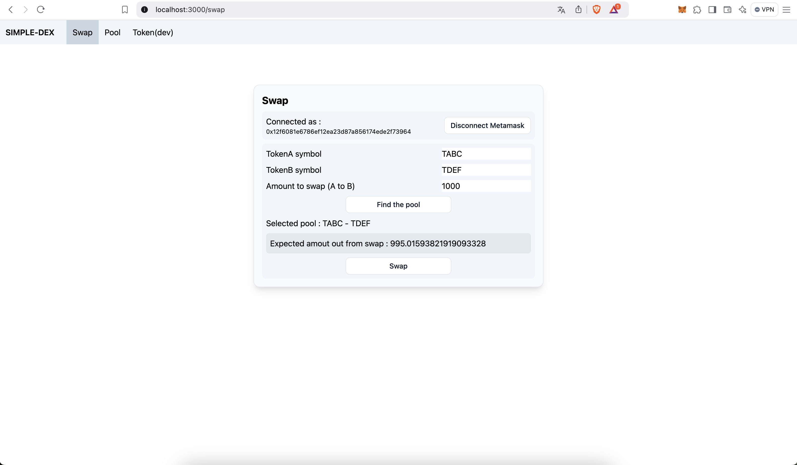
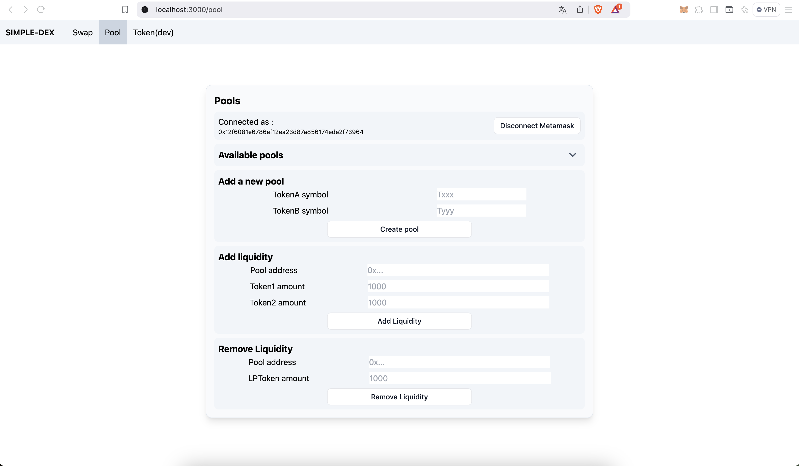
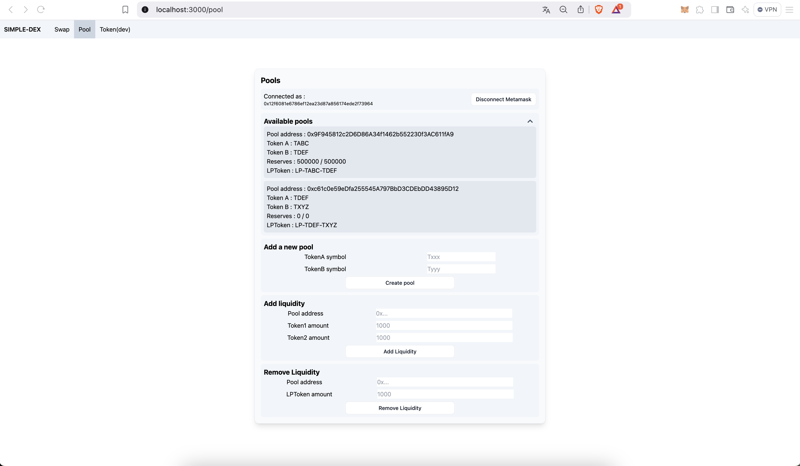
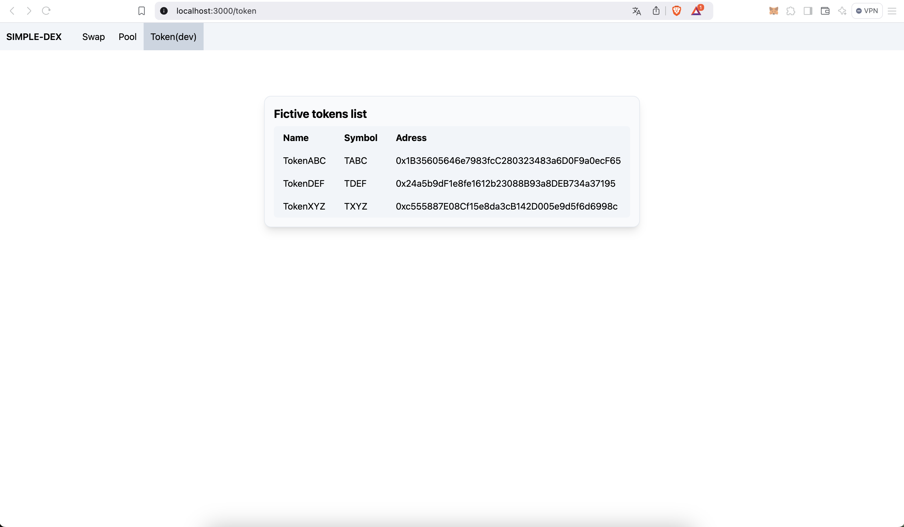

# simple-dex

Simple Decentralized Exchange app built using Solidity Smart Contracts and a React front-end interface

## Overview

This project is a **simple decentralized exchange (DEX)**. It works with the associated smart-contracts coded in **Solidity** and deployed on a **Ganache simulation blockchain**. The frontend is build with **React** and styled with **TailWindCSS**. It allows users to:

- **Swap ERC-20 tokens**.
- **Create and manage liquidity pools** (each pool has a **custom ERC-20 LP tokens**).
- Provide (in exchange of LP tokens) and withdraw back liquidity. A liquidity provider receives a **0.3% fee** in proportion to its share of the total liquidity in the pool.
- Frontend interface allows user to interact with a local blockchain (Ganache) for testing.

The project is for educational purposes only and is not intended for deployment on a mainnet.

## Technologies Used

Blockchain related :

- **Solidity** : Smart contract programming.
- **Truffle** : Ethereum development framework.
- **Ganache** : Local blockchain for testing.

Frontend related :

- **React** : Frontend framework.
- **Web3.js** : Blockchain interaction library.
- **Tailwind CSS** : Styling.
- **Metamask** : Wallet integration.

## Project Structure

```
simple-dex/
│── frontend/        # React-based frontend
│── smart-contracts/ # Compiled contract artifacts
│── readmeAssets/    # Images for readme.md
│── README.md        # Global README (this file)
```

## Usage

#### Connecting a Wallet

On each page where you can interact with the blockain you can connect your browser wallet :

- Click "Connect Wallet" (Metamask required).
- Accept the Metamask connection request.

#### Swapping Tokens

- Select two tokens by writting their symbols.
- Click "Find the pool".
- Select an amount to swap.
- Approve the swap.
- Execute the transaction.

#### Managing Liquidity

- Create a new pool
- Add liquidity to an existing pool
- Withdraw back liquidity when needed (by giving back LP token you receive)

### App screnshots









## Smart Contracts

All the smart contract are written using Solidity. Some of the contracts also use **@openzeppelin** dependencies to match current blockchain standards.

- **DexFactory** : Manages liquidity pools.
- **DexPool** : Handles token swaps and liquidity.
- **DexLiquidityToken** : Represents LP shares.
- **TestToken** : Fictitious ERC-20 tokens for testing.

For a detailed explanation, see `./smart-contracts/README.md`.

## Frontend

The frontend is built with React, Web3.js, and Tailwind CSS.

Main Components :

- **Swap.js** : Token swapping interface.
- **Pool.js** : Liquidity pool management.
- **Token.js** : List of available tokens.
- **Navbar.js** : Navigation bar.
- **WalletBox.js** : Metamask connection.

For more details, see `./frontend/README.md`.

## Installation & Setup

### Prerequisites

- **Node.js** (v14 or later)
- **Truffle** (npm install -g truffle)
- **Ganache** (GUI or CLI)
- **Metamask** installed in your browser

### Clone the repository

```
git clone git@github.com:yannduffo/simple-dex.git
```

Follow instructions from the 2 others `README.md`

### Blockchain related

Start the blockchain (Ganache)

```
ganache-cli --port 7545
```

Or use the Ganache GUI.

Deploy smart contracts

```
cd smart-contracts
truffle migrate --reset
```

### Start the frontend

Install dependencies :

```
cd frontend
npm install
```

Strat it

```
npm start
```

<br>
<br>
<br>
Created by Yann Duffo
